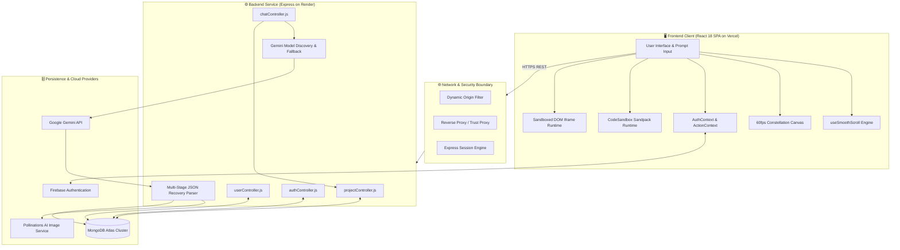

# 🏛️ GenWeb Studio - System Architecture & Technical Reference

This document provides an in-depth technical analysis of **GenWeb Studio**, detailing its subsystem design, execution lifecycles, AI inference pipeline, data modeling, sandboxing mechanisms, and engineering trade-offs.

---

## 📑 Table of Contents

- [1. Executive System Overview](#1-executive-system-overview)
- [2. System Topology & Component Diagram](#2-system-topology--component-diagram)
- [3. Frontend Architecture](#3-frontend-architecture)
  - [3.1 Application Shell & Routing Topology](#31-application-shell--routing-topology)
  - [3.2 Dual In-Browser Sandboxing Engine](#32-dual-in-browser-sandboxing-engine)
  - [3.3 Motion Engineering & Scroll Physics](#33-motion-engineering--scroll-physics)
- [4. Backend Architecture & API Layer](#4-backend-architecture--api-layer)
  - [4.1 Express Bootstrap & Reverse Proxy Strategy](#41-express-bootstrap--reverse-proxy-strategy)
  - [4.2 Authentication & Session Bridging](#42-authentication--session-bridging)
  - [4.3 Dynamic Cross-Origin Resource Sharing (CORS)](#43-dynamic-cross-origin-resource-sharing-cors)
- [5. AI Synthesis Pipeline & Resilience Engine](#5-ai-synthesis-pipeline--resilience-engine)
  - [5.1 Dynamic Model Discovery & Fallback Cascade](#51-dynamic-model-discovery--fallback-cascade)
  - [5.2 Dual Target Prompting Strategy](#52-dual-target-prompting-strategy)
  - [5.3 Multi-Stage JSON Recovery Parser](#53-multi-stage-json-recovery-parser)
  - [5.4 Contextual Visual Asset Enrichment](#54-contextual-visual-asset-enrichment)
- [6. Data Model & Persistence Layer](#6-data-model--persistence-layer)
  - [6.1 Entity-Relationship Structure](#61-entity-relationship-structure)
  - [6.2 Document Schemas](#62-document-schemas)
- [7. Security Architecture & Isolation](#7-security-architecture--isolation)
- [8. Architectural Trade-offs & Decisions](#8-architectural-trade-offs--decisions)

---

## 1. Executive System Overview

GenWeb Studio is a decoupled, cloud-hosted platform enabling prompt-to-application web synthesis. The system operates on a client-orchestrated, server-mediated model:

1. **Client (React 18 SPA)**: Provides user interaction, prompt authoring, real-time code previewing, and visual canvas manipulation (drag-and-drop reordering, palette injection).
2. **Backend (Express.js REST API)**: Manages persistence, authentication sessions, project governance, and model orchestration.
3. **Inference (Google Gemini API)**: Decomposes natural language specifications into multi-file React architectures or semantic HTML/CSS/JavaScript.
4. **Execution Runtimes**: Employs client-side virtualization via CodeSandbox Sandpack for React apps and sandboxed `<iframe>` contexts for vanilla web projects.

---

## 2. System Topology & Component Diagram



---

## 3. Frontend Architecture

### 3.1 Application Shell & Routing Topology

The frontend is built on **React 18** and **React Router v7**, maintaining a clear separation between public marketing/discovery views and dedicated development workspaces.

```text
/                      -> Landing.jsx (Hero typewriter, prompt input, feature cards)
/universal             -> UniversalPage.jsx (Community showcase feed, voting, fork)
/profile               -> Profile.jsx (User dashboard, saved projects, stats)
/about                 -> About.jsx (Platform architecture & capabilities)
/main/react/:projectid -> MainPageReact.js (React workspace with Sandpack editor)
/main/plain/:projectid -> MainPagePlain.js (Vanilla HTML/CSS/JS workspace)
```

- **Shell Isolation (`App.js`)**: Public routes mount the global navigation (`Navbar.jsx`), footer (`Footer.jsx`), and animated canvas (`AnimatedBackground.jsx`). When a workspace route is active (`/main/*`), the application unmounts marketing chrome to allocate 100% of the viewport to the code editor and live execution preview.
- **Error Boundaries (`ErrorBoundary.jsx`)**: Encloses top-level routing and Sandpack clients to intercept rendering anomalies, providing graceful recovery without hard page crashes.

### 3.2 Dual In-Browser Sandboxing Engine

GenWeb Studio avoids server-side container orchestration (e.g., Docker or WebContainers) for code execution. Instead, execution occurs entirely in the user's browser, eliminating backend compute costs and server latency:

#### A. React Workspace (`MainPageReact.js`)
- **Bundler**: Embeds `@codesandbox/sandpack-react` with the `@codesandbox/sandpack-themes` preset.
- **Execution Model**: Sandpack runs an in-browser bundler inside an isolated Service Worker/Iframe environment. It dynamically resolves dependencies (such as `lucide-react`, `react`, and `react-dom`), transpiles JSX/ESModules on the fly, and supports Hot Module Replacement (HMR).
- **File Virtualization**: The model output (`files` dictionary) maps directly to Sandpack's virtual file tree:
  ```json
  {
    "/App.js": { "code": "..." },
    "/components/Navbar.js": { "code": "..." }
  }
  ```

#### B. Plain Web Workspace (`MainPagePlain.js`)
- **Execution Model**: Employs a sandboxed `<iframe>` element. The composite HTML document is generated in memory by assembling the model's `html`, `css`, and `js` outputs.
- **Live DOM Ingestion**: Stylesheet changes and JavaScript alterations are injected via `srcDoc` updates without causing parent window navigation.
- **Interactive Drag & Drop**: Injectable client script adds draggable attributes to section boundaries, allowing users to reorder DOM nodes visually. The updated DOM hierarchy is serialized back to HTML state.
- **Responsive Frame Matrix**: The preview container supports dynamic viewport constraints:
  - **Desktop**: 100% width.
  - **Tablet**: Fixed `768px` width.
  - **Mobile**: Fixed `375px` width with mobile device framing.

### 3.3 Motion Engineering & Scroll Physics

1. **Momentum-Damped Scrolling (`useSmoothScroll.js`)**:
   - Standard Windows/Linux mice produce discrete 100–120px stepped wheel notches.
   - The hook intercepts non-editable wheel events (`passive: false`) while respecting textareas, inputs, and modal dialogs.
   - An internal `requestAnimationFrame` loop computes damped exponential movement (`currentY += (targetY - currentY) * 0.1`) to provide continuous 60/120 FPS gliding motion.
2. **Constellation Particle System (`AnimatedBackground.jsx`)**:
   - Implements an HTML5 2D Canvas rendering 52 desktop / 36 tablet / 22 mobile particles.
   - Scroll parallax is computed within the canvas coordinate loop rather than mutating DOM element transforms. Particles receive vertical scroll inertia (`p.y -= scrollDrift`) with automatic boundary wrap-around.
   - Proximity detection (`Math.hypot < maxDist`) connects node pairs with dynamic alpha strokes. When three nodes mutually connect, the engine renders a translucent polygonal facet (`ctx.fill()`).
3. **GPU-Optimized Aurora Blobs**:
   - Replaced costly 90px CSS Gaussian blur convolution kernels with multi-stop radial gradient falloffs (`radial-gradient(circle closest-side, ...)`).
   - Elements are isolated to independent GPU compositing layers via `willChange: "transform"` and hardware translate transforms.

---

## 4. Backend Architecture & API Layer

### 4.1 Express Bootstrap & Reverse Proxy Strategy

The backend service is an **Express 4.21** application hosted in Node.js:

- **Payload Capacities**: Configured with `express.json({ limit: '10mb' })` and `express.urlencoded({ limit: '10mb' })` to accommodate multi-file project codebases and chat histories.
- **Proxy Trust Configuration**:
  ```javascript
  if (process.env.NODE_ENV === 'production') {
    app.set('trust proxy', 1);
  }
  ```
  Ensures that TLS offloading performed by reverse proxies (e.g., Render, Cloudflare) is accurately detected by Express, enabling `Secure` cookie transmission over HTTPS.

### 4.2 Authentication & Session Bridging

The platform supports both Firebase Google OAuth and traditional Passport sessions:

1. **Client-Side Authentication**: The user signs in via Firebase SDK (`signInWithPopup(auth, googleProvider)`).
2. **Session Exchange (`/auth/firebase-login`)**: The frontend forwards user identity details (`name`, `email`, `imageURL`) to the backend.
3. **User Upsert**: The backend verifies or provisions the `User` document in MongoDB Atlas and binds the authenticated identity to `req.session.user`.
4. **Session Bridge Middleware**:
  ```javascript
  app.use((req, res, next) => {
    if (!req.user && req.session && req.session.user) {
      req.user = req.session.user;
    }
    next();
  });
  ```
  Guarantees compatibility across controllers expecting Passport's `req.user` or native session storage.

### 4.3 Dynamic Cross-Origin Resource Sharing (CORS)

Because preview deployments generate dynamic hostnames (e.g., `genweb-studio-*-*.vercel.app`), the backend implements dynamic origin validation:

```javascript
app.use(
  cors({
    origin: function (origin, callback) {
      if (!origin) return callback(null, true);
      if (
        origin.includes("localhost") ||
        origin.endsWith(".vercel.app") ||
        (process.env.CLIENT_URL && origin.startsWith(process.env.CLIENT_URL.replace(/\/+$/, '')))
      ) {
        return callback(null, true);
      }
      return callback(null, true);
    },
    methods: ["GET", "POST", "PUT", "DELETE", "OPTIONS"],
    credentials: true,
    allowedHeaders: ["Content-Type", "Authorization", "X-Requested-With"],
  })
);
```

---

## 5. AI Synthesis Pipeline & Resilience Engine

The AI subsystem (`backend/controllers/chatController.js`) orchestrates model discovery, prompt construction, parsing recovery, and asset enrichment.

### 5.1 Dynamic Model Discovery & Fallback Cascade

Rather than hardcoding a single Gemini model ID that may encounter rate limits or deprecations, the backend queries the Google Gemini API directly upon invocation:

1. **Model Discovery (`discoverModels`)**: Queries both `v1beta` and `v1` `/models` endpoints using the configured `GEMINI_API_KEY`.
2. **Filtering**: Excludes non-text modalities (`audio`, `embed`, `vision`, `robotics`, `tts`).
3. **Priority Sorter**: Sorts available generation candidates by latency and reliability:
   - `gemini-3.5-flash-lite` (highest priority)
   - `gemini-3.5-flash`
   - `gemini-flash-lite-latest`
   - `gemini-2.5-flash`
   - `gemini-1.5-flash-latest`
4. **Cascade Execution (`callGeminiAPI`)**: Iterates through candidate models using a 28-second timeout window. If a model returns an error or rate-limit status, the pipeline automatically falls back to the next available model in the sequence.

### 5.2 Dual Target Prompting Strategy

Prompt formulation adapts dynamically depending on project type:

- **React Projects**: Instructs Gemini to return a structured file map (`{ "files": { "/App.js": { "code": "..." } } }`), utilizing modern React hooks, inline/Tailwind styles, and standard ESModule imports.
- **Plain Projects**: Instructs Gemini to emit a tripartite structure (`{ "html": "...", "css": "...", "js": "...", "explanation": "..." }`), requiring semantic layout tags and draggable layout markers.

### 5.3 Multi-Stage JSON Recovery Parser

Large language models occasionally wrap JSON outputs in unescaped control characters or trailing explanations. `safeParseAIResponse` implements a 6-stage recovery engine:

```text
[Raw Model Response]
        │
        ▼
Stage 1: Strip markdown code fences (```json ... ```)
        │
        ▼
Stage 2: Slice from first '{' to last '}'
        │
        ▼
Stage 3: Attempt direct JSON.parse()  ──[Success]──> Return Object
        │ (Failure)
        ▼
Stage 4: Sanitize illegal control characters (\n, \r, \t in strings)
        │
        ▼
Stage 5: Regex field boundary extraction:
         - Plain Mode: Slice "html", "css", "js" tokens
         - React Mode: Slice "files" object boundaries
        │
        ▼
Stage 6: HTML attribute quote sanitization (repair unescaped quotes in tags)
        │
        ▼
[Throw Controlled Error if unrecoverable]
```

### 5.4 Contextual Visual Asset Enrichment

To eliminate broken images and generic gray placeholder boxes, the backend post-processes model output with `replaceImageSrc`:

1. Parses all `` tags in the generated HTML or React code.
2. Extracts descriptive metadata from the `alt` attribute (e.g., `alt="Modern luxury cafe interior"`).
3. If the image source is empty or a placeholder, it replaces the URL with a contextual Pollinations AI endpoint:
   ```text
   https://image.pollinations.ai/prompt/<encoded-alt-text>?width=1024&height=768&nologo=true
   ```
4. Existing external URLs (e.g., Unsplash) are preserved.

---

## 6. Data Model & Persistence Layer

### 6.1 Entity-Relationship Structure

```text
┌────────────────────────┐             ┌─────────────────────────┐
│         User           │             │         Project         │
├────────────────────────┤             ├─────────────────────────┤
│ _id: ObjectId          │ 1         * │ _id: ObjectId           │
│ name: String           ├────────────►│ owner: ObjectId (User)  │
│ email: String (unique) │             │ users: [ObjectId]       │
│ imageURL: String       │             │ name: String            │
│ projects: [ObjectId]   │             │ description: String     │
│ createdAt: Date        │             │ visibility: Boolean     │
└────────────────────────┘             │ projectType: Boolean    │
                                       │ chats: [ChatSchema]     │
                                       │ votes: VoteSubdocument  │
                                       │ voteCount: Number       │
                                       │ createdAt: Date         │
                                       └─────────────────────────┘
```

### 6.2 Document Schemas

#### A. Project Schema (`backend/models/projectModel.js`)
- `name`: Human-readable project title.
- `owner`: Reference to the creating `User` document.
- `visibility`: Boolean flag (`true` = public on `/universal`, `false` = private).
- `projectType`: Boolean flag (`true` = React project, `false` = Plain HTML/CSS/JS).
- `chats`: Array of conversational iteration turns:
  - `userprompt`: The prompt input by the user.
  - `airesponse`: Stringified JSON containing the complete file tree or HTML/CSS/JS payload.
  - `text`: Model explanation summary.
  - `time`: Human-readable generation timestamp.
- `votes`: Subdocument tracking community engagement:
  - `upvotes`: Array of User IDs.
  - `downvotes`: Array of User IDs.
- `voteCount`: Precomputed scalar (`upvotes.length - downvotes.length`) for sorting.

#### B. User Schema (`backend/models/userModel.js`)
- `name`: Display name from Google Profile.
- `email`: User email address (unique key).
- `imageURL`: Avatar image URL.
- `projects`: Array of Project references associated with the user.

---

## 7. Security Architecture & Isolation

1. **Client-Side Iframe Isolation**:
   - Plain web previews execute within sandboxed iframes.
   - Scripts within the preview cannot access parent cookies or local storage contexts.
2. **Cross-Site Cookie Handling**:
   - In production (`NODE_ENV === 'production'`), Express session cookies are marked `SameSite=None; Secure`.
   - Allows cross-origin authentication when the frontend is hosted on Vercel (`*.vercel.app`) and the backend is hosted on Render (`*.onrender.com`).
3. **CORS Origin Filtering**:
   - Restricts API access to localhost development hosts, Vercel deployments, and explicitly configured `CLIENT_URL` domains.
4. **Current Security Boundary Notes**:
   - Endpoints such as `POST /chat/:pid` and `POST /project/add` currently do not require mandatory authentication middleware.
   - Client requests are validated for schema integrity but not currently throttled by IP rate limiting.

---

## 8. Architectural Trade-offs & Decisions

| Decision | Chosen Approach | Alternative Considered | Engineering Rationale |
| :--- | :--- | :--- | :--- |
| **Execution Sandboxing** | In-Browser Sandpack & Iframe | Server-Side Docker / WebContainers | Running sandboxes in the browser eliminates compute server costs, scales to arbitrary concurrent users without container cold starts, and prevents server-side remote code execution risks. |
| **Model Selection** | Dynamic Discovery with Fallbacks | Hardcoded Single Model ID | Gemini model versions evolve rapidly. The dynamic discovery cascade queries active models on the key and falls back automatically if a specific variant hits quota or is deprecated. |
| **Response Format** | Single JSON Document Envelope | Server-Sent Events (SSE) Streaming | Because the client requires a structurally valid multi-file AST or unified HTML bundle before mounting Sandpack/Iframe, full validation and Pollinations image enrichment must occur prior to rendering. |
| **Asset Strategy** | Contextual Dynamic Generative URLs | Static Stock Images / Local Assets | Avoids shipping static image bundles or displaying broken asset icons. Generates high-resolution images matching the specific website domain on demand. |
| **Session Model** | Express Cookie Session + Firebase ID | Stateless JWT Tokens | Simplifies cross-tab state synchronization, integrates with Passport OAuth redirects, and centralizes session invalidation on the backend. |

---

<div align="center">
  <sub>GenWeb Studio Architecture Documentation • Maintained by Pratik Suralkar</sub>
</div>
