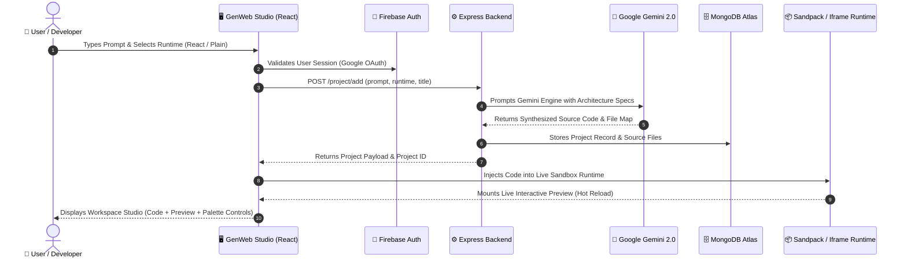

# ⚡ GenWeb Studio

<div align="center">

  

  <h3>AI-Powered Full-Stack Website Generator & Live Sandbox Studio</h3>
  <p><em>Generate responsive web applications from natural language prompts using Google Gemini and live in-browser sandboxes.</em></p>

  <p>
    <a href="https://genweb-studio-frontend.vercel.app/" target="_blank">
      
    </a>
    <a href="https://github.com/Pratik202005/genweb-studio" target="_blank">
      
    </a>
  </p>

  <p>
    
    
    
    
    
    
    
    
  </p>

</div>

---

## 📑 Table of Contents

- [Overview](#-overview)
- [Key Features](#-key-features)
- [Project Architecture & Directory Structure](#-project-architecture--directory-structure)
- [Technology Stack](#-technology-stack)
- [System Architecture & Data Flow](#-system-architecture--data-flow)
- [REST API Reference](#-rest-api-reference)
- [Environment Configuration](#-environment-configuration)
- [Local Development & Quickstart](#-local-development--quickstart)
- [Production Deployment Guide](#-production-deployment-guide)
- [Known Limitations & Roadmap](#-known-limitations--roadmap)
- [Contributing](#-contributing)
- [Author & Acknowledgments](#-author--acknowledgments)

---

## 🌟 Overview

**GenWeb Studio** is an open-source, AI-assisted web application generator. By connecting **Google Gemini** language models with in-browser execution environments (CodeSandbox Sandpack and sandboxed iframes), users can describe a web page or layout in plain English and view the generated application directly in the browser.

The platform generates multi-file React component trees or single-bundle HTML/CSS/JavaScript websites, complete with styling, responsive layouts, and contextual images.

---

## ✨ Key Features

### 🤖 AI Generation & Iteration
- **Natural Language Synthesis**: Translates prompts into complete web applications using Google Gemini models (with automated fallback discovery prioritizing `gemini-3.5-flash-lite`, `gemini-2.5-flash`, and compatible variants).
- **Dual Runtime Support**:
  - **React Runtime**: Multi-file component architectures with React Router and scoped styles.
  - **Plain Runtime**: Semantic HTML5, modern CSS, and vanilla JavaScript.
- **Contextual Visual Assets**: Automatically fetches royalty-free contextual images via Pollinations AI based on image `alt` attributes instead of using blank placeholders.
- **Conversational Iterations**: Chat interface in the workspace to modify existing layouts and refine code without regenerating from scratch.

### 🎨 Live Studio & Interactive Sandboxes
- **In-Browser Code Execution**:
  - Live sandboxing powered by **CodeSandbox Sandpack** for React applications.
  - Sandboxed iframe with dynamic stylesheet injection and DOM parsing for HTML/CSS/JS.
- **Drag-and-Drop Layout Reordering**: Visual section reordering with real-time DOM restructuring and dotted layout indicators.
- **Multi-Device Viewport Switching**: Toggle between Desktop, Tablet, and Mobile viewport modes with constrained preview frames.
- **Theme Palette Switcher**: Real-time theme injection across five color palettes (Modern Indigo, Emerald Cyber, Amber Sunset, Rose Velvet, Midnight Minimal).
- **Source Export**: Download synthesized web projects as a `.zip` archive or copy code directly from the editor.

### ⚡ Smooth Motion & Responsive Controls
- **Momentum-Damped Scrolling**: Custom `useSmoothScroll` hook converts stepped mouse wheel ticks into continuous 60/120 FPS momentum scrolling without interfering with form inputs or touch devices.
- **Constellation Background Animation**: HTML5 Canvas particle system where dots connect and form translucent geometric facets that glide with scroll position.
- **Reduced Rendering Overhead**: Replaced heavy Gaussian blur filters on aurora blobs with multi-stop radial gradient falloffs to reduce GPU compositing cost.

### 🔐 User Profiles & Project Persistence
- **Google Authentication**: Social login powered by Firebase Authentication with session management on the Express backend.
- **Project Storage**: MongoDB Atlas persistence for saving, editing, and managing generated projects.
- **Public Showcase Feed**: Explore public community projects, test live demos, and submit upvotes/downvotes.

---

## 📂 Project Architecture & Directory Structure

### Top-Level Structure

```text
genweb-studio/
├── LICENSE                        # MIT License
├── README.md                      # Project documentation
├── .gitignore                     # Git tracking ignore rules
└── genweb studio/                 # Main workspace directory
    ├── backend/                   # Express.js REST API & AI generation service
    │   ├── config/                # Passport OAuth strategy configuration
    │   ├── controllers/           # Request handlers and Gemini integration
    │   ├── models/                # Mongoose database schemas
    │   ├── routers/               # Express route definitions
    │   ├── app.js                 # Express server bootstrap, CORS & session setup
    │   └── package.json           # Backend dependencies and scripts
    └── frontend/                  # React 18 Single Page Application
        ├── public/                # Static assets, logos & web manifest
        ├── src/                   # React components, pages, hooks & styles
        ├── tailwind.config.js     # Tailwind CSS theme configuration
        ├── vercel.json            # Vercel client-side routing rewrites
        └── package.json           # Frontend dependencies and scripts
```

<details>
<summary>Full file tree</summary>

```text
genweb-studio/
├── LICENSE                        # MIT License
├── README.md                      # Project documentation
├── .gitignore                     # Root git tracking ignore rules
└── genweb studio/
    ├── backend/
    │   ├── .env.example           # Backend environment variables template
    │   ├── package.json           # Backend dependencies & start scripts
    │   ├── app.js                 # Server entry point, CORS & session config
    │   ├── config/
    │   │   └── passport.js        # Passport Google OAuth strategy setup
    │   ├── controllers/
    │   │   ├── authController.js  # Session authentication & Firebase login handlers
    │   │   ├── chatController.js  # Gemini AI prompt execution & code parsing
    │   │   ├── projectController.js # Project CRUD, voting, and copy handlers
    │   │   └── userController.js  # User profile and user projects handlers
    │   ├── models/
    │   │   ├── projectModel.js    # Project schema (chats, files, runtime, votes)
    │   │   └── userModel.js       # User schema (name, email, imageURL)
    │   └── routers/
    │       ├── auth.js            # Authentication endpoints (/auth)
    │       ├── chatRoutes.js      # AI prompt endpoints (/chat)
    │       ├── projectRoutes.js   # Project management endpoints (/project)
    │       └── userRoutes.js      # User profile endpoints (/user)
    │
    └── frontend/
        ├── .env.example           # Frontend environment template
        ├── package.json           # Frontend dependencies & build scripts
        ├── tailwind.config.js     # Tailwind CSS design system tokens
        ├── vercel.json            # Vercel client-side rewrite rules
        ├── public/
        │   ├── favicon.svg        # Vector brand icon
        │   ├── logo.png           # Raster logo asset
        │   └── manifest.json      # PWA web manifest
        └── src/
            ├── App.js             # Route definitions & smooth scroll provider
            ├── App.css            # Global CSS keyframes
            ├── index.css          # Tailwind base, utilities & scroll rules
            ├── index.js           # React DOM mounting entry point
            ├── firebase.js        # Firebase SDK client initialization
            ├── components/
            │   ├── AnimatedBackground.jsx # Canvas particles & aurora glow
            │   ├── ErrorBoundary.jsx  # React UI error boundary
            │   ├── Footer.jsx         # Site footer
            │   ├── GenerationProgress.jsx # Progress indicator overlay
            │   ├── Introduction.jsx   # Hero section & feature cards
            │   ├── Logo.jsx           # Brand logo SVG component
            │   ├── Navbar.jsx         # Top navigation bar
            │   ├── Prompt.jsx         # Prompt input and starter templates
            │   ├── ProtectedRoute.jsx # Authentication route wrapper
            │   ├── TemplateCard.jsx   # Project showcase card
            │   └── project.jsx        # Project list item card
            ├── hooks/
            │   ├── hardPrompts.js     # Starter prompt templates
            │   ├── useSmoothScroll.js # Momentum-damped wheel scroll hook
            │   ├── useVoting.js       # Upvote/downvote state handler
            │   └── userContext.js     # Global Firebase auth session context
            ├── lib/
            │   ├── motionTokens.js    # Framer Motion animation tokens
            │   └── utils.js           # Class name utility (clsx + tailwind-merge)
            └── pages/
                ├── About.jsx          # About page
                ├── ActionContext.js   # Studio action event context
                ├── Landing.jsx        # Main landing page
                ├── MainPagePlain.js   # HTML/CSS/JS Studio workspace
                ├── MainPageReact.js   # React Sandpack Studio workspace
                ├── Profile.jsx        # User profile & project manager
                ├── SandpackPreviewClient.js # Sandpack preview client bridge
                └── UniversalPage.jsx  # Public project explore feed
```

</details>

---

## 🛠️ Technology Stack

| Layer | Technologies | Purpose |
| :--- | :--- | :--- |
| **Frontend Framework** | React 18.3, React Router v7 | Single Page Application architecture and routing |
| **Styling & Design** | Tailwind CSS 3.4, PostCSS | Utility classes, responsive layouts, dark theme styling |
| **Animations & FX** | Framer Motion, HTML5 Canvas 2D | Interface animations, card tilts, and particle background |
| **Code Sandboxing** | CodeSandbox Sandpack React | In-browser bundler and live React execution |
| **Backend Framework** | Node.js 18+, Express.js 4.21 | REST API, session management, CORS configuration |
| **AI Inference** | Google Gemini API (`@google/generative-ai`) | Code generation from natural language prompts |
| **Database** | MongoDB Atlas, Mongoose 8.9 | Storage for user accounts, generated code, and chat history |
| **Authentication** | Firebase Auth & Express Sessions | Google sign-in and session state persistence |
| **Hosting** | Vercel (Frontend), Render (Backend) | Static web hosting and cloud server deployment |

---

## 🔄 System Architecture & Data Flow



---

## 🔌 REST API Reference

### 1. Projects (`/project`)

| Method | Endpoint | Description | Auth Enforced |
| :--- | :--- | :--- | :---: |
| `POST` | `/project/add` | Creates a new project record. Associates with session user, body `userId`, or a default creator user. | None |
| `GET` | `/project/:pid` | Fetches a single project by ID, including code and chat history. | None |
| `PUT` | `/project/:pid/edit` | Updates project fields (name, description, visibility, etc.). | None |
| `DELETE`| `/project/:pid/delete`| Deletes a project by ID. | None |
| `GET` | `/project/visible` | Returns all public projects (`visibility: true`) for the Explore feed. | None |
| `POST` | `/project/vote` | Submits an upvote or downvote for a project (`projectId`, `voteType`, `userId`). | None |
| `POST` | `/project/copy/:pid` | Clones an existing project into a new record for the current user. | None |

### 2. AI Chat & Iteration (`/chat`)

| Method | Endpoint | Description | Auth Enforced |
| :--- | :--- | :--- | :---: |
| `POST` | `/chat/:pid` | Sends a prompt to the Gemini API to generate or modify code for project `:pid`. Returns JSON. | None |
| `GET` | `/chat/getchat/:pid` | Returns chat history records for project `:pid`. | None |

### 3. Authentication (`/auth`)

| Method | Endpoint | Description | Auth Enforced |
| :--- | :--- | :--- | :---: |
| `POST` | `/auth/firebase-login` | Synchronizes Firebase user details (`email`, `name`, `imageURL`) to MongoDB and sets session. | None |
| `GET` | `/auth/google` | Redirects to Google OAuth login via Passport. | None |
| `GET` | `/auth/google/callback`| Handles Google OAuth callback and redirects to client URL. | None |
| `GET` | `/auth/login/success` | Returns authenticated user object from session; returns 401 if no session exists. | Session |
| `GET` | `/auth/login/failed` | Returns 401 error message for failed logins. | None |
| `GET` | `/auth/logout` | Destroys current session and clears session cookie. | None |

### 4. User Profile (`/user`)

| Method | Endpoint | Description | Auth Enforced |
| :--- | :--- | :--- | :---: |
| `GET` | `/user/my` | Returns profile data for current user (from session or `?userId=...`). Returns `null` if unauthenticated. | Session / Query |
| `PUT` | `/user/my` | Updates profile data for current user (from session or body `userId`). | Session / Body |
| `GET` | `/user/my/project` | Returns projects owned by current user (from session or `?userId=...`). Returns `[]` if unauthenticated. | Session / Query |
| `GET` | `/user/:userid` | Returns public profile data for a specific user ID. | None |

### 5. Utility & Search

| Method | Endpoint | Description | Auth Enforced |
| :--- | :--- | :--- | :---: |
| `GET` | `/` | Health check endpoint returning `{ status: 'ok' }`. | None |
| `GET` | `/search` | Returns user records (`_id`, `name`, `email`). | None |

---

## ⚙️ Environment Configuration

### Backend Configuration (`genweb studio/backend/.env`)

```env
# Server Port & Mode
PORT=5000
NODE_ENV=development

# Session Encryption Secret
SECRETKEY=your_session_secret

# Frontend Application URL (Used for CORS whitelist)
CLIENT_URL=http://localhost:3000

# MongoDB Database Connection String
MONGODB_URI=mongodb+srv://<username>:<password>@cluster0.mongodb.net/genweb_studio?retryWrites=true&w=majority

# Google Gemini API Key (Obtain from Google AI Studio)
GEMINI_API_KEY=your_gemini_api_key
```

### Frontend Configuration (`genweb studio/frontend/.env`)

```env
# Backend API Base URL (must include trailing slash)
REACT_APP_BACKEND_URL=http://localhost:5000/

# Firebase Authentication Client Configuration
REACT_APP_FIREBASE_API_KEY=your_firebase_api_key
REACT_APP_FIREBASE_AUTH_DOMAIN=your-project-id.firebaseapp.com
REACT_APP_FIREBASE_PROJECT_ID=your-project-id
REACT_APP_FIREBASE_STORAGE_BUCKET=your-project-id.appspot.com
REACT_APP_FIREBASE_MESSAGING_SENDER_ID=your_messaging_sender_id
REACT_APP_FIREBASE_APP_ID=your_firebase_app_id
```

---

## 🚀 Local Development & Quickstart

### Prerequisites
- **Node.js** `v18.0.0` or higher
- **npm** `v9.0.0` or higher
- **MongoDB** instance (Local community server or MongoDB Atlas cluster)
- **Google Gemini API Key** (from [Google AI Studio](https://aistudio.google.com/))
- **Firebase Project** with Google Sign-In enabled (from [Firebase Console](https://console.firebase.google.com/))

### Step 1: Clone the Repository
```bash
git clone https://github.com/Pratik202005/genweb-studio.git
cd genweb-studio
```

### Step 2: Setup & Launch the Backend
```bash
# Navigate to the backend directory
cd "genweb studio/backend"

# Install backend dependencies
npm install

# Create environment configuration file
cp .env.example .env
# Edit .env with your MONGODB_URI and GEMINI_API_KEY

# Start the backend server (runs node app.js)
npm start
```
*The backend API server starts on `http://localhost:5000`.*

### Step 3: Setup & Launch the Frontend
```bash
# In a new terminal, navigate to the frontend directory
cd "genweb studio/frontend"

# Install frontend dependencies
npm install --legacy-peer-deps

# Create environment configuration file
cp .env.example .env
# Edit .env with your Firebase keys and REACT_APP_BACKEND_URL

# Start the frontend development server
npm start
```
*The web interface will open at `http://localhost:3000`.*

---

## 🌐 Production Deployment Guide

### Deploying Frontend to Vercel

1. Push your repository to GitHub.
2. In the [Vercel Dashboard](https://vercel.com/), select **Add New Project** and import `genweb-studio`.
3. Set the **Root Directory** to `"genweb studio/frontend"`.
4. Configure Build Settings:
   - **Framework Preset**: `Create React App`
   - **Build Command**: `cross-env CI=false react-scripts build`
   - **Output Directory**: `build`
5. Configure Environment Variables:
   - `REACT_APP_BACKEND_URL`: Production backend URL (e.g. `https://your-backend.onrender.com/`).
   - `REACT_APP_FIREBASE_*`: Your Firebase project credentials.
6. Deploy. Client-side routing rewrites are handled by [vercel.json](file:///c:/Users/PRASAD%20SURALKAR/Downloads/genweb%20studio/genweb%20studio/frontend/vercel.json).

### Deploying Backend to Render

1. In [Render Dashboard](https://dashboard.render.com/), create a new **Web Service**.
2. Connect your repository and configure:
   - **Root Directory**: `"genweb studio/backend"`
   - **Environment**: `Node`
   - **Build Command**: `npm install`
   - **Start Command**: `node app.js` (or `npm start`)
3. Add Backend Environment Variables:
   - `PORT`: `5000` (or leave default for Render)
   - `NODE_ENV`: `production`
   - `SECRETKEY`: `your_session_secret`
   - `CLIENT_URL`: `https://your-frontend-app.vercel.app`
   - `MONGODB_URI`: Your MongoDB Atlas connection URI
   - `GEMINI_API_KEY`: Your Google Gemini API key
4. In the Firebase Console, go to **Authentication** > **Settings** > **Authorized Domains** and add your Vercel deployment domain.

---

## ⚠️ Known Limitations & Roadmap

- **Authentication on Generation Endpoints**: Endpoints such as `POST /chat/:pid` and `POST /project/add` currently allow execution without mandatory authentication middleware. Enforcing authenticated sessions on all AI generation endpoints is planned.
- **Rate Limiting**: There is currently no server-side rate limiter on code generation endpoints. Implementing request throttling per IP / user session is planned to prevent API abuse.
- **Granular Project Authorization**: Project modification (`PUT /project/:pid/edit`) and deletion (`DELETE /project/:pid/delete`) currently do not enforce owner-validation middleware. Adding ownership guards is planned.

---

## 🤝 Contributing

Contributions, issues, and feature requests are welcome!

1. Fork the Project
2. Create your Feature Branch (`git checkout -b feature/NewFeature`)
3. Commit your Changes (`git commit -m 'feat: add NewFeature'`)
4. Push to the Branch (`git push origin feature/NewFeature`)
5. Open a Pull Request

---

## 👤 Author & Acknowledgments

- **Pratik Suralkar** — *Creator & Developer*
  - GitHub: [@Pratik202005](https://github.com/Pratik202005)

### Acknowledgments
- **Google DeepMind & Google Gemini** for language generation APIs.
- **CodeSandbox** for the Sandpack in-browser bundling engine.
- **Tailwind Labs** & **Lucide Icons** for UI primitives.

---

<div align="center">
  <sub>Distributed under the MIT License.</sub>
</div>
